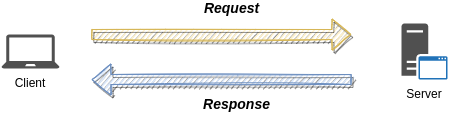
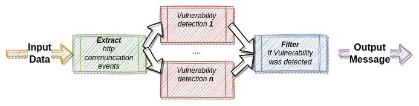

# http-header-appscope


This demo presents observabiliy setup based on AppScope and Logstream.

Let's focus on simple client-server communication 




In context of control/observability we can say that:

|    Component    	| Can be observed by the `Server` side 	| Is fully controlled by the `Server` side 	|
|:---------------:	|--------------------------------------	|:----------------------------------------:	|
| Client          	| No                                   	| No                                       	|
| Client Request  	| Yes                                  	| No                                       	|
| Server Response 	| Yes                                  	| Yes                                      	|
| Server          	| Yes                                  	| Yes                                      	|

As we can see we are able to get informations from interface channels `Request` and `Response` I will prove that from the
information retrieved byt the `AppScope` and analyzed by the
`Stream` we can detect potential vulnerability related to HTTP headers.

- [GET request bodies](https://developers.cloudflare.com/cache/best-practices/avoid-web-poisoning/#do-not-trust-get-request-bodies)
- CVE-2018-14773

The detection part can be done on Server side but:

- the server implemenation can be changed
- server side can scaled up
- we don't want to waste server memory&CPU rersources for the detection
- we want to have robust mechanism which can be used on different application as well

The Stream logic is presented below based on Fan Out & Fan In solution




## Contents
1. [Prerequisites](#prerequisites)
2. [Intro](#intro)
2. [Overview](#overview)
	* [Logstream configuration](#logstream-configuration)
3. [Building and Running](#building-and-running)
	* [Build Demo](#build-demo)
	* [Testing](#testing)
	* [Scoping the bash session](#scoping-the-bash-session)
	* [Scoping on demand](#scoping-on-demand)
	* [Clean up Demo](#clean-up-demo)

## Prerequisites
For this demo environment, you will need Docker, `bash` and a `curl`.


This demo shows how vulnerabily can be catched


## Overview

This demo environment uses:

- [AppScope](https://appscope.dev/) to instrument application running in demo environment.
- [Logstream](https://cribl.io/logstream/) as a agent
- [Monitoring server] is based on TCP Monitoring on stream

By default services will be available on following URL:

|Service|URL|
|-------|---|
|LogStream|[http://localhost:9000](http://localhost:9000)|

If you need some custom values please modify `.env` file.


## Logstream configuration

The diagram below depicts the Logstream configuration


## Building and Running

The demo provides two interfaces:
- scoping the bash session `appscope01`
- scoping individual command `appscope02`

- running AppScope on host
To extend the functionality by using AppScope on host, please extend the ports settings in
`cribl01` configuration with following:

```
  cribl01:
    ...
    ports:
      - "${CRIBL_HOST_PORT:-9000}:9000"
      - 10070:10070
```

Set destination path to `tcp://127.0.0.1:10070` allows sending data to the observability setup.

## Build Demo

To build the demo, simply run `start.sh`:

```bash
./start.sh
```

## Testing

To confirm that everything works correctly:

```
docker ps
```

TODO FILL THIS


## Clean up Demo

To clean up the demo, simply run `stop.sh`:

```bash
./stop.sh
```
