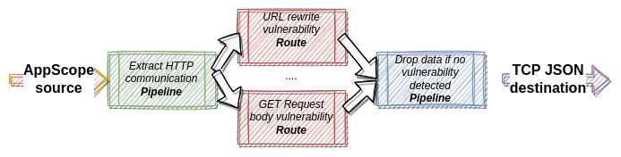

# http-header-appscope


This demo presents observability setup based on AppScope and Logstream used for detection 

Let's focus on simple client-server communication 


In context of control/observability we can say that:

|    Component    | Can be observed by the `Server` side | Is fully controlled by the `Server` side |
|:---------------:|--------------------------------------|:----------------------------------------:|
| Client          | No                                   | No                                       |
| Client Request  | Yes                                  | No                                       |
| Server Response | Yes                                  | Yes                                      |
| Server          | Yes                                  | Yes                                      |

As we can see we are able to get information from interface channels presented as `Request` and `Response`.
The expected purpose of interface channels is to exchange information between server side and external world - but since it is a way to it is natural source of vector attacks.

I will prove that from the information retrieved byt the `AppScope` and analyzed/transformed by the
`LogStream` we can detect potential security vulnerability e.g. related to HTTP headers:

- [CVE-2018-14773](https://nvd.nist.gov/vuln/detail/CVE-2018-14773)
- [GET request bodies](https://developers.cloudflare.com/cache/best-practices/avoid-web-poisoning/#do-not-trust-get-request-bodies)

Identification of the problems mentioned above can be done on `Server` side **BUT** there are several advantage of solution based on separate component:

- `Robustness` - `Server` implementation can be replaced/changed/updated and the detection of the potential issue can be missed after previously mentioned operation.
- `Availability of resources` - we don't want to waste `Server` memory & CPU for the detection of securtity flaws.
- `Scalability` - since we have defined rules the detection scheme can be used for different services running in our organization.

The first approach which comes natural  my mind is a `Fan Out & Fan In` solution to model security vulnerability and apply it  variety rules 


Comparing idea above to [LogStream](https://docs.cribl.io/assets/images/Cribl-diagram-complex-3.0c-5398281873041df2a7ec0e404b9f2bef.png)

The `Logstream` pipeline looks as a natural solution to the solution to the problem above:



AppScope scope the `Server` described as `service1` in docker.compose.yml file.
Client generates three type of message:

- valid one
- one for CVE-2018-14773
- one for GET request bodies
## Contents
1. [Prerequisites](#prerequisites)
2. [Intro](#intro)
2. [Overview](#overview)
	* [Logstream configuration](#logstream-configuration)
3. [Building and Running](#building-and-running)
	* [Build Demo](#build-demo)
	* [Testing](#testing)
	* [Clean up Demo](#clean-up-demo)

## Prerequisites
For this demo environment, you will need Docker and a `bash`.

This demo shows how HTTP vulnerability can be detected using data gatherred from AppScope and Logstream possibilities

## Overview

This demo environment uses:

- [AppScope](https://appscope.dev/) to instrument application running in demo environment.
- [Logstream](https://cribl.io/logstream/) as a agent

By default services will be available on following URL:

|Service|URL|
|-------|---|
|LogStream|[http://localhost:9000](http://localhost:9000)|

If you need some custom values please modify `.env` file.

## Logstream configuration

The diagram below depicts the Logstream configuration

## Build Demo

To build the demo, simply run `start.sh`:

```bash
./start.sh
```

## Testing

To confirm that everything works correctly:

```
docker ps
```

```
9032d27b82ef   http-header-appscope_client_attacker1   "python3 main.py --v…"   About a minute ago   Up About a minute                                               client_attacker1
375a0ca25f0b   http-header-appscope_client_normal      "python3 main.py --v…"   About a minute ago   Up About a minute                                               client_normal
79434ee018cd   http-header-appscope_service1           "./ldscope -- python…"   About a minute ago   Up About a minute                                               service1
917b435934dc   http-header-appscope_client_attacker2   "python3 main.py --v…"   About a minute ago   Up About a minute                                               client_attacker2
e2897e7e5cda   cribl/cribl:3.3.1                       "/sbin/entrypoint.sh…"   About a minute ago   Up About a minute   0.0.0.0:9000->9000/tcp, :::9000->9000/tcp   cribl01
```

Proceed to:

http://localhost:9000/inputs/tcpjson/in_tcp_json?tab=live

To observe the results of simulation.

## Clean up Demo

To clean up the demo, simply run `stop.sh`:

```bash
./stop.sh
```

## TODO
- extend the demo with additional servers implementations (JS, go, Java)
- extend the demo with proxy as load balancer
